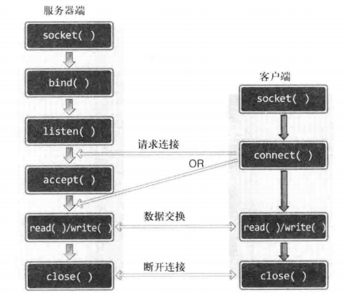

# TCP/IP

### 套接字

####  基于TCP的服务器端/客户端函数调用关系



#### 使用函数列表

```c
/**** Linux和windows相同的套接字相关函数 ****/
//创建套接字
int socket(int domain, int type, int protocol); 

//分配IP地址和端口号
int bind(iht sockfd, struct sockaddr * myaddr, socklen_t addrlen);

//转为可接受的请求状态
//backlog:连接请求等待队列的长度
int listen(int sockfd, int backlog);

//受理连接请求
int accept(int sockfd, struct sockaddr * addr, socklen_t * addrlen);

//请求连接
int connect(int sockfd, struct sockaddr * serv_addr, socklen_t addrlen);

/*****  使用windos时必须以下两个函数进行winsock的初始化和注销 ****/
/*****  需要导入头文件winsock2.h，链接ws2_32.lib库			****/

//winsock初始化
//wVersionRequested:使用的Winsock版本信息。使用MAKEWORD(1,2),主版本1，副版本2
//LPWSADATA:WSADATA结构体变量的地址
int WSAStartup(WORD wVersionRequested, LPWSADATA lpWASAData);

//winsock注销
int WSACleanup(void);

/**** winsock独有 ****/

//关闭套接字
int closesocket(SOCKET s);

========================================================================
    
/**** Linux文件操作（Linux的sock操作和文件操作无区别） ****/
    
//打开文件
int open(const char * path, int flag);		//flag可以通过位运算"|"符组合并传递多个参数

//关闭文件
int close(int fd);		//文件描述符

//写入文件（Linux套接字同）
ssize_t write(int fd, const void * buf, size_t nbytes);

//读取文件 (Linux套接字同）
ssize_t read(int fd, void * buf, size_t nbytes);

/**** windows 的套接字I/O(Linux直接与文件I/O相同即:read()和write())  ****/

//winsock传输函数
int send(SOCKET s, const char * buf, int len, int flags);

//winsock接收函数
int recv(SOCKET s, const char * buf, int len, int flags);

```


#### 接受连接请求的套接字创建过程(server端)

1. 调用socket函数创建套接字。
2. 调用bind函数分配IP地址和端口号。
3. 调用listen函数转为可接受的请求状态。
4. 调用accept函数受理连接请求。


### 地址信息的表示

1. ==sockaddr_in==  (作为地址信息传递给bind函数)

```C
struct sockaddr_in
{
	sa_family_t     sin_family;  //地址族
    unit16          sin_port;    //16位TCP/UDP端口号
    struct in_addr  sin_addr;	 //32位IP地址
    char			sin_zero[8]  //不使用
};

struct in_addr
{
    In_addr_t 		s_addr;		//32位IPV4地址
};

in_addr_t	//unit32_t（32位bit）
```

2. ==sockaddr==  

```C
struct sockaddr
{
	sa_family_t		sin_falily;		//地址族
    char			sa_data[14];	//地址信息（包含IP地址和端口号）
};
```

3. ==字节序转换==

   3.1 大小端存储

   - 大端存储：高位字节存放在地位地址。（网络字节序选择的方式）
   - 小端存储：高位字节存放在高位地址。

   3.2 字节序转换

   ```C
   //h:住机（host）,n:网络（network），s:short型（2字节），l:long型（4字节）
   
   //把short型数据从主机字节序转化位网络字节序
   unsigned short htons(unsigned short);
   
   unsigned short ntohs(unsigned short);
   
   unsigned long htonl(unsigned long);
   
   unsigned long ntohl(unsigned long);
   
   ```

4. ==字符串信息转换为网络字节序的整数型==

   ```c
   //字符串形式的IP地址转换成32位整型数据(即："1.2.3.4" --> 0x4030201)
   in_addr_t inet_addr(const char * string);
   
   //功能同上,只是无需再次将信息复制到sockaddr_in.sin_addr（windows无此函数）
   int inet_aton(const char * string, struct in_addr * addr);
   
   //32bit -> 字符串 (调用完该函数后，应立即将字符串信息复制到其它内存空间中)
   char * inet_ntoa(struct in_addr adr);
   
   ======================================================================
       
   /****   只存在于windows中的转换函数  ****/
   //优点：在IPv4和IPv6中均可使用
   
   int WSAStringToAddress(
       LPTSTR AddressString, 				//含有IP和端口号的字符串地址
       int AddressFamily, 					//第一个参数中地址所属的地址族信息
       LPWSAPROTOCOL_INFO lpProtocolInfo,  //设置协议提供者，默认为NULL
       LPSOCKADDR lpAddress, 				//保存地址信息的结构体变量地址
       LPINT lpAddressLength				//第四个参数中传递的结构长度所在的变量地址
   );
   
   int WSAAddressToString(
       LPSOCKADDR lpsaAddress, 			//需要转换的地址信息结构体变量地址
       DWORD dwAddressLength,				//第一个参数中结构体变量长度
       LPWSAPROTOCOL_INFO lpProtocolInfo,  //设置协议提供者，默认为NULL
   	LPTSTR lpszAddressString, 			//保存转换结果的字符串地址
       LPDWORD lpdwAddressStringLength		//第四个参数中存有地址信息的字符串长度
   );
   ```

