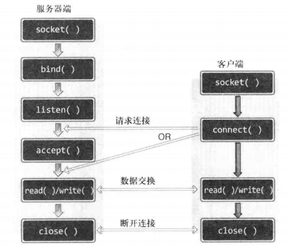

# TCP/IP

### 套接字

####  基于TCP的服务器端/客户端函数调用关系



#### 接受连接请求的套接字创建过程(server端)

1. 调用socket函数创建套接字。
2. 调用bind函数分配IP地址和端口号。
3. 调用listen函数转为可接受的请求状态。
4. 调用accept函数受理连接请求。

==创建套接字，但此时并不马上分为服务器端和客户端。如果紧接着调用bind、listen函数，将成为服务器端套接字；如果调用connect函数，将成为客户端套接字。==


#### 使用函数列表

##### Linux和windows相同的套接字相关函数 

```c
/**
 * @brief：创建套接字
 * @param domain：套接字中使用的协议族信息（例如：PF_INET、PF_INET6、PF_LOCAL、、、）
 * @param type：套接字数据传输类型信息（例如：SOCK_STREAM、SOCK_DGRAM、、、）
 * @param protocol：计算机间通信使用的协议信息(例如：IPPROTO_TCP、IPPROTO_UDP、、、)
 * @return：成功返回socket文件描述符（或句柄），失败返回-1（或SOCKET_ERROR）
 */
int socket(int domain, int type, int protocol); 

/**
 * @brief：分配IP地址和端口号（如果此函数调用成功，则将第二个参数指定的地址信息分配给第一个参数中的相应套接字）
 * @param sockfd：要分配地址信息的套接字描述符
 * @param myaddr：地址信息的结构体变量地址
 * @param addrlen：第二个结构体变量的长度
 * @return：成功返回0，失败返回-1
 */
int bind(int sockfd, struct sockaddr * myaddr, socklen_t addrlen);

/**
 * @brief：将套接字转为可接收连接状态
 * @param sockfd：希望进入等待连接请求的套接字文件描述符，传递的套接字文件描述符参数为服务器端套接字（监听套接字）
 * @param backlog：连接请求等待队列的长度
 * @return：成功返回0，失败返回-1
 */
int listen(int sockfd, int backlog);

/**
 * @brief：受理连接请求等待队列中待处理的客户连接请求。（若调用成功，函数内部将自动产生用于数据I/O的套接字）
 * @param sockfd：服务器套接字的文件描述符
 * @param addr：发起连接请求的客户端地址，调用函数后将传递来的地址变量参数填充客户端地址
 * @param addrlen：第二个参数的长度，但是存有长度的变量地址。函数调用完成后，该变量即被填入客户端地址长度
 * @return：成功返回创建的套接字文件描述符（或句柄），失败返回-1（或SOCKET_ERROR）
 */
int accept(int sockfd, struct sockaddr * addr, socklen_t * addrlen);

/**
 * @brief：（向服务器端）请求连接
 * @param sockfd：客户端套接字文件描述符
 * @param servaddr：目标服务器地址信息的变量地址
 * @param addrlen：第二个参数servaddr的地址变量长度
 * @return：成功返回0，失败返回-1
 */
int connect(int sockfd, struct sockaddr * servaddr, socklen_t addrlen);

/**
 * @brief：半关闭
 * @param sock：需要断开的套接字文件描述符（或句柄）
 * @param howto：传递断开的方式，Linux:SHUT_RD、SHUT_WR、SHUT_RDWR,windows：SD_RECEIVE、SD_SEND、SD_BOTH
 * @return：成功返回0，失败返回-1（或SOCKET_ERROR）
 */
int shutdown(int sock, int howto);

```
##### windos下winsock独有的相关函数

```c
/*****  使用windos时必须以下两个函数进行winsock的初始化和注销 ****/
/*****  需要导入头文件winsock2.h，链接ws2_32.lib库			****/

/**
 * @brief：winsock初始化	
 * @param wVersionRequested:使用的Winsock版本信息。使用MAKEWORD(1,2),主版本1，副版本2
 * @param lpWSAData:WSADATA结构体变量的地址
 * @return：成功返回0，失败返回非零的错误代码值
 */
int WSAStartup(WORD wVersionRequested, LPWSADATA lpWASAData);

/**
 * @brief：winsock注销
 * @return：成功返回0，失败返回SOCKET_ERROR
 */
int WSACleanup(void);

/**
 * @brief：关闭windows的套接字	
 * @param fd：需要关闭的套接字的文件描述符
 * @return：成功返回0，失败返回SOCKET_ERROR
 */
int closesocket(SOCKET s);

```
##### 文件操作的相关函数 （Linux的sock操作和文件操作无区别）

```C
/**
 * @brief：打开文件	
 * @param path：文件名的字符串地址
 * @param flag：文件打开模式，可以通过位运算"|"符组合并传递多个模式
 * @return：成功返回文件描述符，失败返回-1
 */
int open(const char * path, int flag);	

/**
 * @brief：关闭文件（或Linux的套接字）	
 * @param fd：需要关闭的文件或套接字的文件描述符
 * @return：成功返回0，失败返回-1
 */
int close(int fd);

/**
 * @brief：写入文件（Linux套接字同）	
 * @param fd：数据传输对象的文件描述符
 * @param buf：需要传输数据的缓冲地址值
 * @param nbytes：要传输数据的字节数
 * @return：成功返回写入的字节数，失败返回-1
 */
ssize_t write(int fd, const void * buf, size_t nbytes);

/**
 * @brief：读取文件 (Linux套接字同）	
 * @param fd：数据接收对象的文件描述符
 * @param buf：需要传输数据的缓冲地址值
 * @param nbytes：要传输数据的字节数
 * @return：成功返回写入的字节数，失败返回-1
 */
ssize_t read(int fd, void * buf, size_t nbytes);
```
##### windows 的套接字I/O

```c
/****Linux直接与文件I/O相同即:read()和write()，以下为Windows独有 ****/

/**
 * @brief：winsock数据传输函数	
 * @param s：数据传输对象连接的套接字句柄值
 * @param buf：需要传输数据的缓冲地址值
 * @param len：要传输数据的字节数
 * @param flags：传输数据时用到的多种选项信息
 * @return：成功时返回传输字节数，失败返回SOCKET_ERROR
 */
int send(SOCKET s, const char * buf, int len, int flags);

/**
 * @brief：winsock数据接收函数
 * @param s：数据接收对象连接的套接字句柄值
 * @param buf：需要保存数据的缓冲地址值
 * @param len：能够接收的最大字节数
 * @param flags：接收数据时用到的多种选项信息
 * @return：成功时返回接收到字节数（收到EOF时为0），失败返回SOCKET_ERROR
 */
int recv(SOCKET s, const char * buf, int len, int flags);

```
##### UDP的数据I/O (Linux和windows相同)

```c
/**
 * @brief：UDP传输数据函数
 * @param sock：用于传输数据的UDP套接字文件描述符
 * @param buf：保存待传输数据的缓冲地址
 * @param hbytes：待传输数据长度
 * @param flags：可选参数，若没有则传递0
 * @param to：存有目标地址（服务端）信息的sockaddr结构体变量的地址
 * @param addrlen：传递给参数to的地址结构体变量长度
 * @return：成功时返回传输的字节数，失败返回-1
 */
ssize_t sendto(int sock, void * buf, size_t hbytes, int flags,
               struct sockaddr * to, socklen_t addrlen);

/**
 * @breief：UDP接收数据函数
 * @param sock：用于接收数据的UDP套接字文件描述符
 * @param buf：保存接收数据的缓冲地址
 * @param hbytes：可接收的最大字节数，故无法超过参数buff所指的缓存大小
 * @param flags：可选参数，若没有则传递0
 * @param from：指向存放对端地址的区域（发送数据源的地址被复制到相应的sockaddr结构中）
 * @param addrlen：参数from的地址结构体变量长度
 * @return：成功时返回接收到字节数（收到EOF时为0），失败返回-1
 */
ssize_t recvfrom(int sock, void * buf, size_t hbytes, int flags,
                 struct sockaddr * from, socklen_t addrlen);

```

### 地址信息的表示

1. ==sockaddr_in==  (作为地址信息传递给bind函数)

```C
struct sockaddr_in
{
	sa_family_t     sin_family;  //地址族
    unit16          sin_port;    //16位TCP/UDP端口号
    struct in_addr  sin_addr;	 //32位IP地址
    char			sin_zero[8]  //不使用
};

struct in_addr
{
    In_addr_t 		s_addr;		//32位IPV4地址
};

in_addr_t	//unit32_t（32位bit）
```

2. ==sockaddr==  

```C
struct sockaddr
{
	sa_family_t		sin_falily;		//地址族
    char			sa_data[14];	//地址信息（包含IP地址和端口号）
};
```

3. ==字节序转换==

   3.1 大小端存储

   - 大端存储：高位字节存放在地位地址。（网络字节序选择的方式）
   - 小端存储：高位字节存放在高位地址。

   3.2 字节序转换

   ```C
   //h:住机（host）,n:网络（network），s:short型（2字节），l:long型（4字节）
   
   //把short型数据从主机字节序转化位网络字节序
   unsigned short htons(unsigned short);
   
   unsigned short ntohs(unsigned short);
   
   unsigned long htonl(unsigned long);
   
   unsigned long ntohl(unsigned long);
   
   ```

4. ==字符串信息转换为网络字节序的整数型==

   ```c
   //字符串形式的IP地址转换成32位整型数据(即："1.2.3.4" --> 0x4030201)
   in_addr_t inet_addr(const char * string);
   
   //功能同上,只是无需再次将信息复制到sockaddr_in.sin_addr（windows无此函数）
   int inet_aton(const char * string, struct in_addr * addr);
   
   //32bit -> 字符串 (调用完该函数后，应立即将字符串信息复制到其它内存空间中)
   char * inet_ntoa(struct in_addr adr);
   
   ======================================================================
       
   /****   只存在于windows中的转换函数  ****/
   //优点：在IPv4和IPv6中均可使用
   
   /**
    * @breief：字符串 -> 32bit 
    * @param AddressString：含有IP和端口号的字符串地址
    * @param AddressFamily：第一个参数中地址所属的地址族信息
    * @param lpProtocolInfo：设置协议提供者，默认为NULL
    * @param lpAddress：保存地址信息的结构体变量地址
    * @param lpAddressLength：第四个参数中传递的结构长度所在的变量地址
    * @return：成功时返回0，失败返回SOCKET_ERROR
    */
   int WSAStringToAddress(LPTSTR AddressString, int AddressFamily,
                          LPWSAPROTOCOL_INFO lpProtocolInfo, 
                          LPSOCKADDR lpAddress, LPINT lpAddressLength);
   
   /**
    * @breief：32bit -> 字符串
    * @param lpsaAddress：需要转换的地址信息结构体变量地址
    * @param dwAddressLength：第一个参数中结构体变量长度
    * @param lpProtocolInfo：设置协议提供者，默认为NULL
    * @param lpszAddressString：保存转换结果的字符串地址
    * @param lpdwAddressStringLength：第四个参数中存有地址信息的字符串长度
    * @return：成功时返回0，失败返回SOCKET_ERROR
    */
   int WSAAddressToString(LPSOCKADDR lpsaAddress, DWORD dwAddressLength, 
                          LPWSAPROTOCOL_INFO lpProtocolInfo,
                          LPTSTR lpszAddressString, LPDWORD lpdwAddressStringLength);
   ```

### 多进程服务器

##### 僵尸进程和孤儿进程（[链接](https://blog.csdn.net/Eunice_fan1207/article/details/81387417?utm_medium=distribute.pc_relevant.none-task-blog-2%7Edefault%7EBlogCommendFromMachineLearnPai2%7Edefault-2.control&depth_1-utm_source=distribute.pc_relevant.none-task-blog-2%7Edefault%7EBlogCommendFromMachineLearnPai2%7Edefault-2.control)）

- 僵尸进程：子进程先于父进程结束，子进程的PCB需要其父进程释放，但是父进程并没有释放子进程的PCB。僵尸进程实际上是一个已经死掉的进程。（子进程运行结束，但父进程还存在，并且父进程为未将子进程销毁）
- 孤儿进程：一个父进程退出，而它的一个或多个子进程还在运行，那么那些子进程将成为孤儿进程。孤儿进程将被init进程(进程号为1)所收养，并由init进程对它们完成状态收集工作。

