# 第一章 概述

## 1.2 分层

TCP/IP是一个四层的协议系统，如图1-1【区别于网络的七层协议】

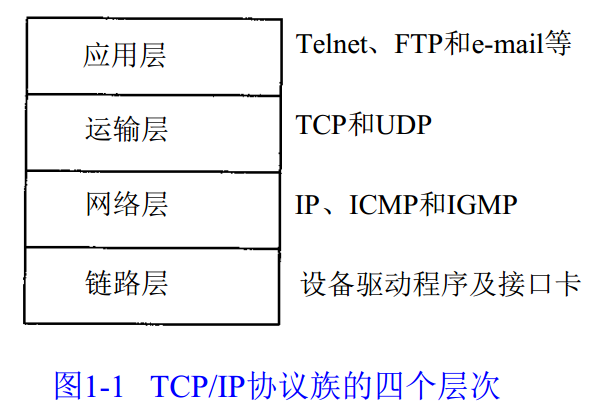

每一层负责不同的功能：

1. 链路层（数据链路层或网际接口层），通常包括操作系统中的设备驱动程序和计算机中对应的网络接口卡。它们一起处理与电缆的物理接口细节。
2. 网络层（互联网层），处理分组在网络中的活动，例如分组的选路。在TCP/IP协议族中，网络层协议包括IP协议（网际协议），ICMP协议（互联网控制报文协议），以及IGMP协议（网络组管理协议）。
3. 运输层主要为两台主机上的应用程序提供端到端的通信。在TCP/IP协议族中，有两个互不相同的传输协议：TCP（传输控制协议）和UDP（用户数据报协议）。
4. 应用层负责处理特定的应用程序细节。几乎各种不同的TCP/IP实现都会提供下面这些通用的应用程序：
   - Telnet 远程登入
   - FTP 文件传输协议
   - SMTP 简单邮件传送协议
   - SNMP 简单网络管理协议

==TCP/IP协议族名称的解释：TCP/IP协议族是一组不同的协议组合在一起构成的协议族。尽管通常称该协议族为TCP/IP，但TCP和IP只是其中的两种协议而已（该协议族的另一个名字是Internet协议族）==

## 1.3 TCP/IP的分层

TCP/IP协议族中不同层次的协议，如图1-4

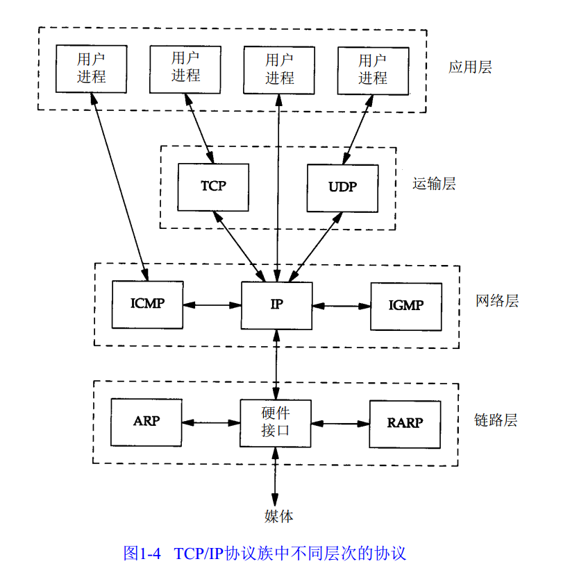

## 1.4 互联网的地址

五类互联网地址格式如图1-5

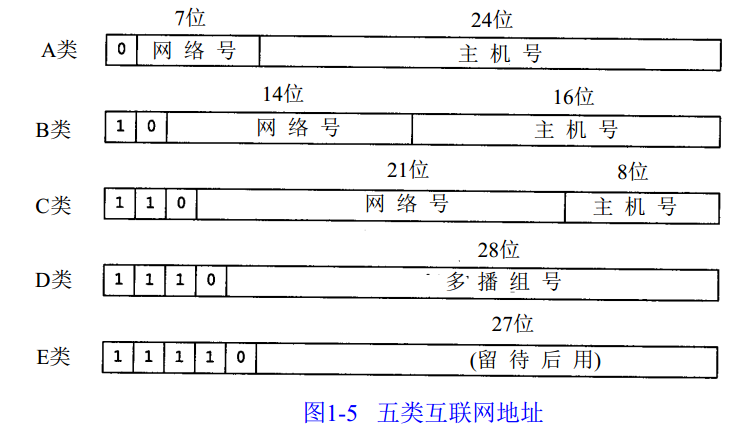

各类地址的起止范围如图1-6

## 1.5 域名系统

提供IP地址和主机名之间的映射信息。

## 1.6 封装

每一层对收到的数据倒要增加一些首部信息（有时还需要增加尾部信息），该过程如图1-7

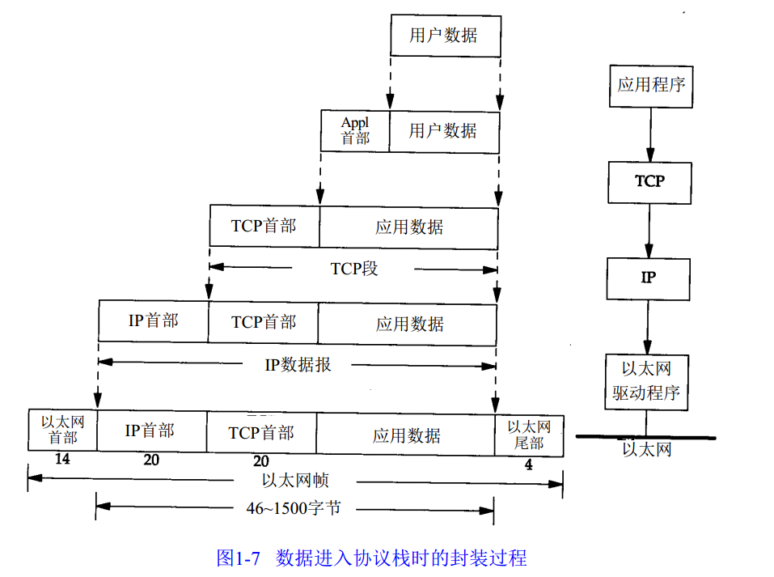

## 1.7 分用

当目的主机收到一个以太网数据帧时，数据就要开始从协议栈中由底向上升，同时去掉各层协议加上的报文首部。每层此协议盒都要去检查报文首部中的协议标识，以确定接收数据的上层协议。这个过程称作分用，图1-8显示了该过程是如何发生的。（接收方去除头部的过程）

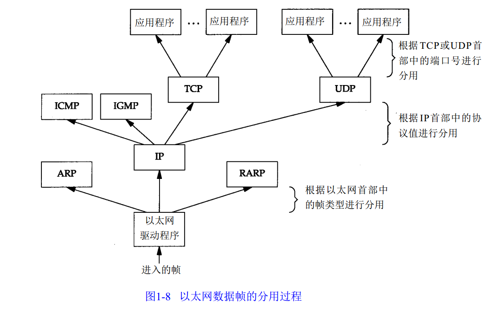

## 1.8 客户-服务器模型

服务器分为两中类型：重复型和并发型。

重复型服务器通过以下步骤进行交互：

1. 等待一个客户请求的到来

2. 处理客户请求

3. 发送相应给发送请求的客户

4. 返回1步

重复型服务器的主要问题发生在2状态。在这个时候，它不能为其它客户机提供服务。

并发型服务器通过以下步骤进行交互：

1. 等待一个客户请求的到来
2. 启动一个性的服务器来处理这个客户的请求。在这期间可能生成一个新的进程、任务或线程，并依赖底层操作系统的支持。这个步骤如何进行取决于操作系统。生成的新服务器对客户的全部请求进行处理。处理结束后，终止这个新服务器。
3. 返回1步

并发服务器的优点在于它是利用生成其它服务器的方法来处理客户的请求。也就是说，每个客户都有它自己对应的服务器。如果操作系统允许多任务，那么就可以同时为多个客户服务。

## 1.9 端口号

端口号1~255的定义为常用端口 。256~1023之间的端口号通常由Unix系统占用。由IANA管理 1~1023之间的所有端口号。 

1024~5000之间为临时端口号。

大于5000的端口号是为其它服务器预留的。

## 1.10 标准化过程

四个小组负责Internet技术：

1. Internet协会
2. Internet体系结构委员会
3. Internet工程专门小组
4. Internet研究专门小组

## 1.11 RFC

所有关于Internet的正式标准都以RFC文档出版。另外，大量的RFC并不是正式的标准，出版的目的只是为了提供信息。数字越大说明RFC越新。

重要的RFC文档:

1. 赋值RFC列出了所有Internet协议中使用的数字和常数。
2. Internet正式协议标准。这个RFC描述了各种Internet协议的标准化现状。每种协议都处在下面几种标准化状态之一:标准、草案标准、提议标准、实验标准、信息标准和历史标准。另外，对每种协议都有一个要求的层次、必需的、建议的、可选择的、限制使用或者不推荐的。
3. 主机需求RFC。
4. 路由需求RFC。

## 1.12 标准的简单服务

有一些标准的简单服务几乎每种实现都要提供。

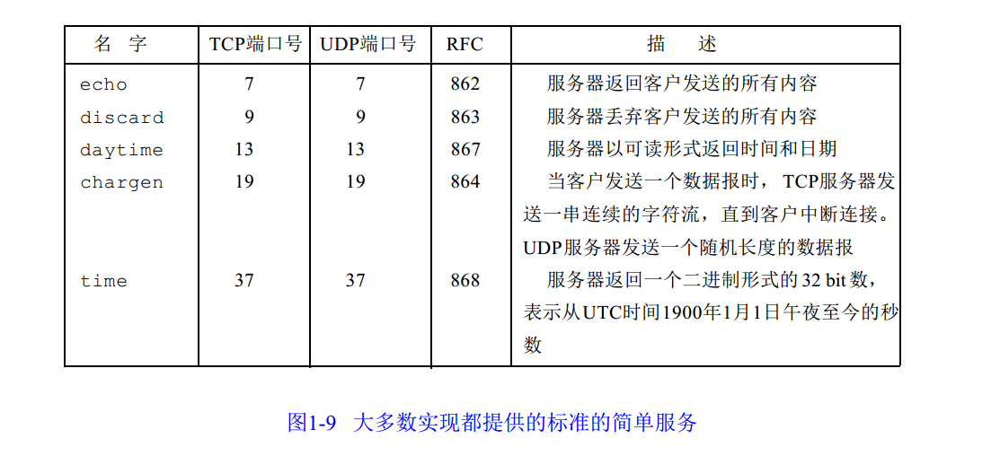

## 1.13 互联网

Internet意思是用一个共同的协议族把多个网络连接在一起。而Internet指的是世界范围内通过TCP/IP互相通信的所有主机集合。Internet是一个internet，但internet不等于Internet。

## 1.14 实现

即成事实标准的TCP/IP软件实现来自于伯克利的加利福尼亚大学的计算机系统研究小组。

## 1.15 应用编程接口

使用TCP/IP协议的应用程序通常采用两种应用编程接口（API）：socket和TLI（运输层接口）

## 1.16 测试网络

# 第二章 链路层

## 2.1 引言

链路层的三个主要目的：

1. 为IP模块发送和接收IP数据报。
2. 为ARP模块发送ARP请求和接收ARP应答。
3. 为RARP发送RARP请求和接收RARP应答。

## 2.2 以太网和IEEE 802封装

### 以太网

1. 这个术语一般是指数字设备公司、英特尔公司和Xerox公司在1982年联合公布的一个标准。它是当今TCP/IP采用的主要的局域网技术。
2. 它采用一种CSMA/CD的媒体接入方法，其意思是带冲突检测的载波侦听多路接入。
3. 速率为10Mb/s，地址为48bit。

### IEEE 802 封装

1. 802.3 针对整个CSMA/CD网络。
2. 802.4 针对令牌总线网络。
3. 802.5 针对令牌环网络。
4. 这三者的共性由802.2 标准来定义，那就是802网络共有的逻辑链路控制（LLC）。

802格式帧和以太网格式帧如图2-1。802.3规定数据部分至少为38字节，以太网则要求至少46字节。

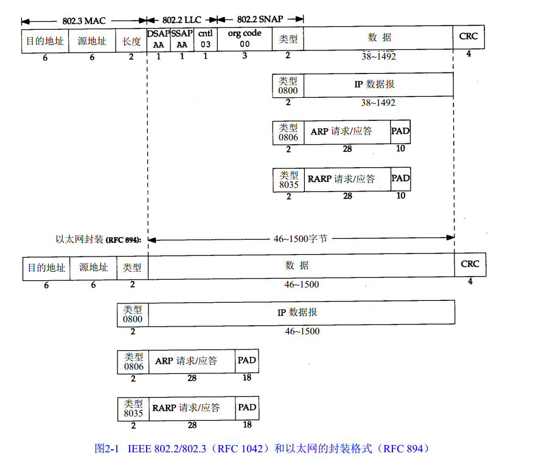

## 2.4 SLIP ：串行线路IP

它是一种在串行线路上对IP数据报进行封装的简单形式。

下面规则描述了SLIP协议定义的帧格式（即信息字段出现特殊字符时需要转义）：

1. IP数据报以一个称作END（0xc0）的特殊字符结束。同时，为了防止数据报到来之前的线路噪声被当成数据报内容大多数实现在数据报的开始处也传一个END字符。
2. 如果IP报文中某个字符为END，那么就要连续传输两个字节0xdb和0xdc来取代它。0xdb这个特殊字符被称作SLIP的ESC字符，但是它的值与ASCII的ESC字符（0x1b）不同。
3. 如果IP报文中某个字符为SLIP的ESC字符，那么就要连续传输两个字节0xdb和0xdd来取代它。

图2-2中的例子就是包含一个END字符和一个ESC字符的IP报文。

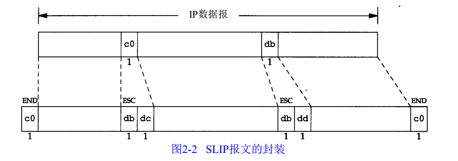

SLIP的缺陷：

1. 每一段必须知道对方的IP地址。没有办法把本端的IP地址同之给另一端。
2. 数据帧中没有类型字段。如果一条串行线路用于SILP，那么它不能同时使用其他协议。
3. SLIP没有在数据帧中加上检验和（类似于以太网中的CRC字段）。如果SLIP传输的报文被线路噪声影响而发生错误，只能通过上层协议来发现。

## 2.5 压缩的SLIP

一般情况下传输1个字节的数据需要20个字节的IP首部和20个字节的TCP首部，总数超过40个字节。

CSLIP（即压缩的SLIP）能把40个字节压缩到3或5字节。

## 2.6 PPP：点对点协议

PPP包括以下三个部分：

1. 在串行链路上封装IP数据报的方法。PPP即支持数据为8位和无奇偶检验的异步模式，还支持面向比特的同步链接。
2. 建立、配置及测试数据链路的链路控制协议。它允许通信双方进行协商，以确定不同的选项。
3. 针对不同网络层协议的网络控制协议体系。当前RFC定义的网络层有IP、OSI网络层、DECnet以及AppleTalk。

每一帧都以标识符0x7e开始和结束。紧接着是一个地址字节，值始终是0xff，然后是一个值为0x03的控制字节。

PPP定义的帧格式（即信息字段出现特殊字符时需要转义）：

1. 当遇到字符0x7e时，需要连续传送两个字符：0x7d和0x5e，以实现标志字符的转义。
2. 当遇到转义字符0x7d时，需连续传送两个字符：0x7d和0x5d，以实现转义符的转义。
3. 默认情况下，如果字符的值小于0x20，一般都需要进行转义。例如，遇到字符0x01时需要连续传送0x7d和0x21两个字符（这时，第6个比特取补码后变为1，而前面两种情况均把它变为0）。

图2-3是PPP数据帧的格式：

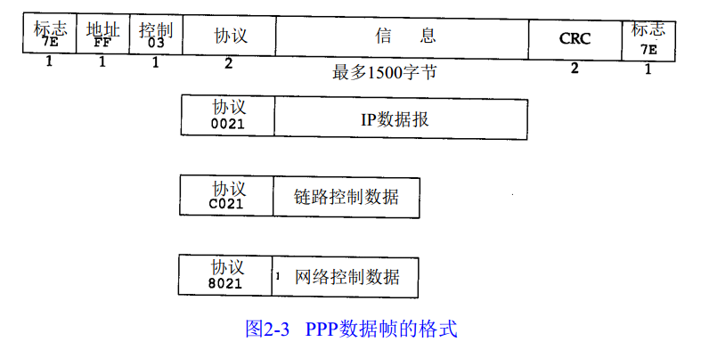

PPP比SLIP具有以下的优点：

1. PPP支持在单根串行线路上运行多种协议，不只是IP协议。
2. 每一帧都有循环冗余检验。
3. 通信双方可以进行IP地址的动态协调（使用IP网络控制协议）。
4. 与CSLIP类似，对TCP和IP报文首部进行压缩。
5. 链路控制协议可以对多个数据链路选项进行设置。

为这些优点付出的代价是在每一帧的首部增加3个字节，当建立链路是要发送几帧协商数据，以及更为复杂的实现。

## 2.7 环回接口

图2-4是环回接口处理IP数据报的简单过程：（？？？不理解）

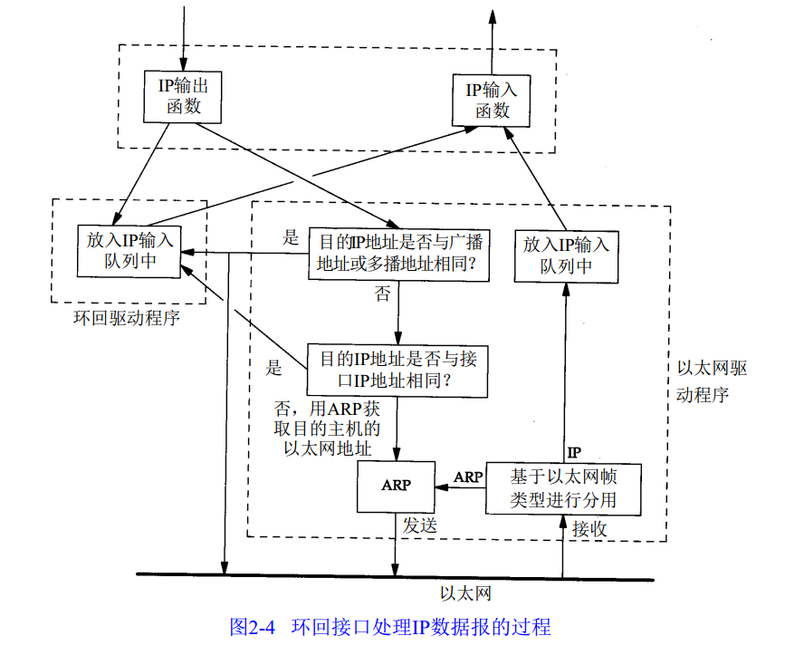

图中需要指出的关键点是：

1. 传给环回地址（一般是127.0.0.1）的任何数据均作为IP输入。
2. 传给广播地址和多播地址的数据报复制一份传给环回接口，然后送到以太网上。这是因为广播传送和多播传送的定义包含主机本身。
3. 任何传给该主机IP地址的数据均送到环回接口。

## 2.8 最大传输单元MTU

正如图2-5看到的那样，以太网和802.3对数据帧的长度都有一个限制，其最大值分别是1500和1492字节。链路层的这个特性称作MTU，最大传输单元。

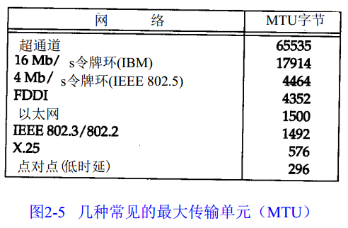

## 2.9 路径MTU

两台通信主机路径中最小的MTU称作路径MTU。

路径MTU在两个方向上不一定是一致的。

## 2.10 串行线路吞吐量计算

# 第3章 IP：网际协议

## 3.1 引言

- IP是TCP/IP协议族中最为核心的协议。所有的TCP、UDP、ICMP及IGMP数据都以IP数据报格式传输。
- IP提供不可靠、无连接的数据报传送服务。
- 不可靠的意思是它不能保证IP数据报能成功地到达目的地。IP仅提供最好的传输服务。如果发生某种错误时，如某个服务器暂时用完了缓冲区，IP有一个简单的错误处理手法：丢弃该数据报，然后发送ICMP消息给信源端。任何要求的可靠性必须由上层来提供（如TCP）。
- 无连接这个术语的意思是IP并不维护任何关于后续数据报的状态信息。每个数据报的处理时相互独立的。这也说明，IP数据报可以不按发送顺序接收。如果一信源向相同的信宿发送两个连续的数据报（先是A，然后是B），每个数据报都是独立地进行路由选择，可能选择不同的路线，因此B可能在A到达之前先到达。
- 介绍两个有用的命令：ifconfig和netstat

## 3.2 IP首部

IP数据报的格式如图3-1所示：

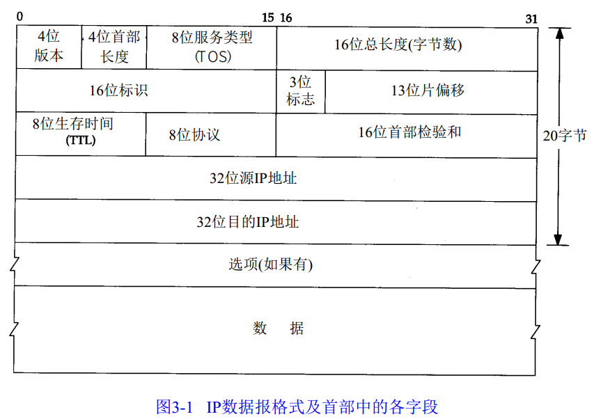

注意，上图表示的数据，最高位在左边，记为0位；最低位在右边，记为31位。在网络中传输数据时，先传输0~ 7位，其次是8~ 15位，然后传输16~ 23位，最后传输24~31位。由于TCP/IP协议头部中所有的二进制数在网络中传输时都要求以这种顺序进行，因此把它称为==网络字节顺序==。在实际编程中，以其他形式存储的二进制数必须在传输数据前使用网络编程API相应的函数把头部转换成网络字节顺序。

IP数据报各字段功能如下：

1. 版本号：占用4位二进制数，表示该IP数据报使用的IP协议版本。目前Internet中使用的主要是TCP/IP协议族中版本号为4的IP协议。

2. 头长度：占用4位二进制位，此域指出整个报头的长度（包括选项），该长度是以==32位二进制数为一个计数单位（4字节）==的，接收端通过此域可以计算出报头在何处结束及从何处开始读数据。普通IP数据报（没有任何选项）该字段的值是5（即20个字节的长度）。

3. 8位服务类型（TOS、type of service）：占用8位二进制位，用于规定本数据报的处理方式。服务类型字段的8位分成了5个子域：

   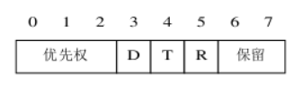

   (1)—优先权（0-7）数越大，表示该数据报优先权越高。网络中路由器可以使用优先权进行拥塞控制，如当网络发生拥塞时可以根据数据报的优先权来决定数据报的取舍。

   (2)—短延迟位D(Delay)：该位置1时，数据报请求以短延迟信道传输，0表示正常延时。

   (3)—高吞吐量位T(Throughput)：该位置1时，数据报请求以高吞吐量信道传输，0表示普通。

   (4)—高可靠位R(Reliability)：该位置1时，数据报请求以高可靠性信道传输，0表示普通。

   (5)—保留位。

   目前在Internet中使用的TCP/IP协议大多数情况下网络并未对TOS进行处理，但在实际编程时，有专门的函数来设置该字段的各域。一些重要的网际应用协议中都设置了建议使用的TOS值：

   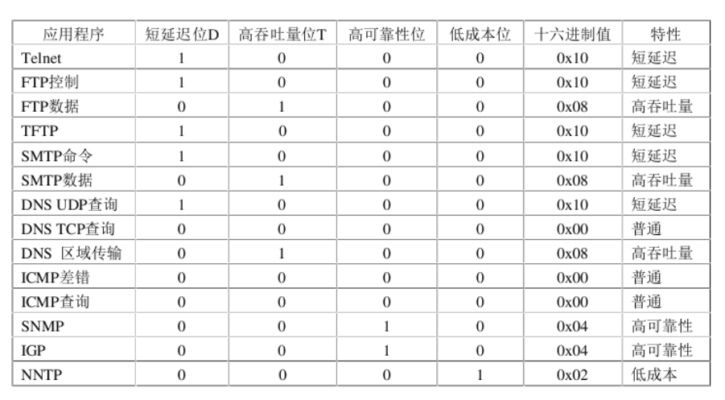

   从上表可以看出，对于与用户直接交互的应用，一般使用短延时；对于有大量数据需要进行传输的应用，一般选用高吞吐量；对于数据报要传输控制信息的应用，一般选用高可靠性。在数据报的生存期内不支持TOS的，TOS字段就设置为0x00

4. 16位总长度（字节数）：占用16位二进制位，总长度字段是指整个IP数据报的长度（报头区+数据区），以字节为单位。利用头部长度字段和总长度字段就可以计算出IP数据报中数据内容的起始位置和长度。由于该字段长度为16位二进制数，因此理论上IP数据报最长可达65536个字节（事实上受物理网络的限制，要比这个数值小很多）。

5. 16位标识：IP软件在存储器中维持一个计数器，每产生一个数据报，计数器就加 1，并将此值赋给标识字段。但这个“标识”并不是序号，因为 IP是无连接的服务，数据报不存在按序接收的问题。当数据报由于长度超过网络的 MTU 而必须分片时，这个标识字段的值就被复制到所有的数据报的标识字段中。相同的标识字段的值使分片后的各数据报片最后能正确地重装成为原来的数据报

6. 3位标志：占3 位，但目前只有2位有意义。标志字段中的最低位记为 MF (More Fragment)。MF=1即表示后面“还有分片”的数据报。MF=0表示这已是若干数据报片中的最后一个。标志字段中间的一位记为 DF(Don't Fragment)，意思是“不能分片”。只有当 DF=0时才允许分片。

7. 13位片偏移：占 13位。较长的分组在分片后，某片在原分组中的相对位置。也就是说，相对用户数据字段的起点，该片从何处开始。片偏移以 ==8个字节为偏移单位==。这就是说，每个分片的长度一定是 8字节 (64位)的整数倍。

8. 生存时间（TTL，time to  live）：占用8位二进制位，它指定了数据报可以在网络中传输的最长时间。实际应用中把生存时间字段设置成了数据报可以经过的最大路由器数。TTL的初始值由源主机设置（通常为32、64、128或256），一旦经过一个处理它的路由器，它的值就减1。当该字段为0时，数据报就丢弃，并发送ICMP报文通知源主机，因此可以防止进入一个循环回路时，数据报无休止地传输下去。

9. 8位协议：占用8位二进制位，IP协议可以承载各种上层协议，目标端根据协议标识就可以把收到的IP数据报送到TCP或UDP等处理此报文的上层协议了。

   常用网际协议编号：

   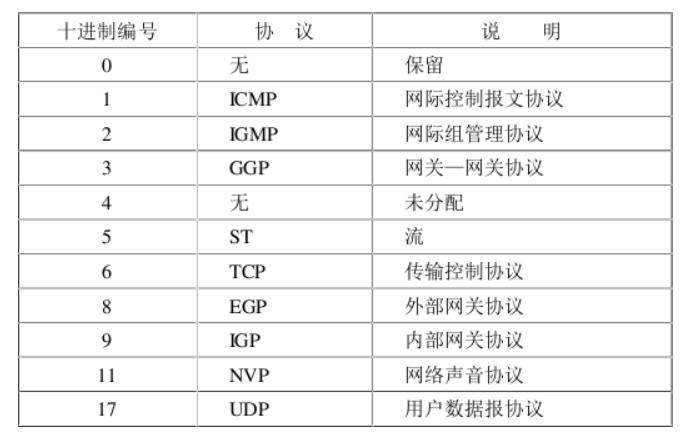

10. 16位首部检验和：占用16位二进制数，用于协议头数据有效性的校验，可以保证IP报头区在传输时的正确性和完整性。头部检验和字段是根据IP协议头计算出的检验和，它不对头部后面的数据进行计算。

    原理：发送端首先将检验和字段置0，然后对头部中每16位二进制数进行反码求和的运算，并将结果存在校验和字段中。 由于接收方在计算过程中包含了发送方放在头部的校验和，因此，如果头部在传输过程中没有发生任何差错，那么接收方计算的结果应该是全1。

11. 源地址：占用32位二进制数，表示发送端IP地址。

12. 目的地址：占用32位二进制数，表述目的端IP地址。

## 3.3 IP路由选择

源ip和目的ip不变，源mac和目的mac随着路由的跳转而改变。

